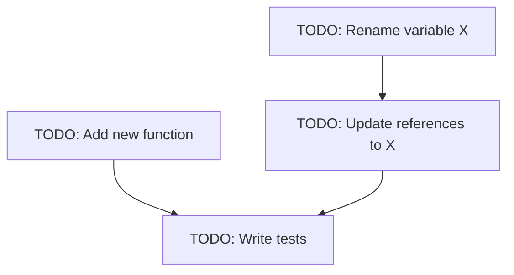

Resolve all TODO comments using parallel processing.

## Arguments

- **file-or-dir-path** (optional): Path to a specific file or directory to scan for TODOs. If omitted, scans the entire repository.

## Workflow

### 1. Gather TODOs

First, identify the scope:
- If an argument is provided, scan that specific file or directory
- If no argument, scan the entire codebase

Search for TODO comments in code files using Grep with pattern: `(?i)TODO|FIXME|XXX`

For each TODO found:
- Extract the TODO text
- Capture the file path and line number
- Include surrounding context (3-5 lines before and after) to understand the background

### 2. List TODOs

Present a comprehensive list of all TODOs with their context:

```markdown
## Found N TODOs

### TODO 1: [Brief description]
**Location:** `path/to/file.ext:line`
**Context:**
\`\`\`language
// Surrounding code context
// With the TODO highlighted
\`\`\`

### TODO 2: ...
```

### 3. Prompt User Confirmation

Ask the user if they want to proceed with resolving all the TODOs:

"Found N TODOs. Do you want to proceed with resolving them? If yes, I'll use parallel processing to handle them efficiently."

Use AskUserQuestion to get confirmation before proceeding.

### 4. Plan Dependencies

Create a TodoWrite list of all TODOs. Analyze dependencies:
- Group TODOs by type (refactoring, feature addition, bug fix, etc.)
- Identify any dependencies between TODOs (e.g., one TODO requires another to complete first)
- Create a mermaid flow diagram showing the resolution order

Example mermaid diagram:


### 5. Resolve in Parallel

For each TODO that has no outstanding dependencies, spawn a general-purpose agent in parallel using the Task tool.

Example with 3 independent TODOs:
```markdown
Launching parallel resolution agents for independent TODOs...

1. Spawning agent for TODO 1
2. Spawning agent for TODO 2
3. Spawning agent for TODO 3
```

Each Task should use subagent_type `general-purpose` with a prompt that includes:
- The TODO description
- The file location and context
- Clear instructions on what needs to be done

### 6. Commit & Resolve

After all parallel agents complete:
- Review the changes made
- Create a descriptive commit message summarizing all resolved TODOs
- Push to remote if configured

## Notes

- The command searches for common TODO patterns: `TODO`, `FIXME`, `XXX`
- Context extraction helps understand the background and purpose of each TODO
- Parallel processing significantly speeds up resolution for independent TODOs
- Dependency analysis ensures correct resolution order
